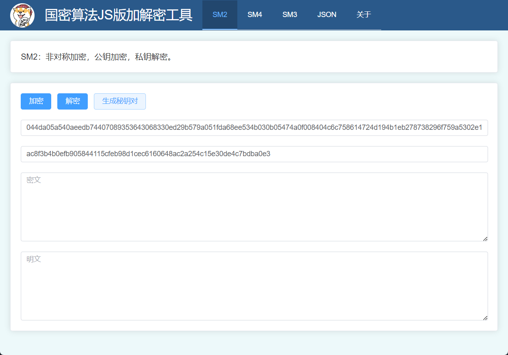
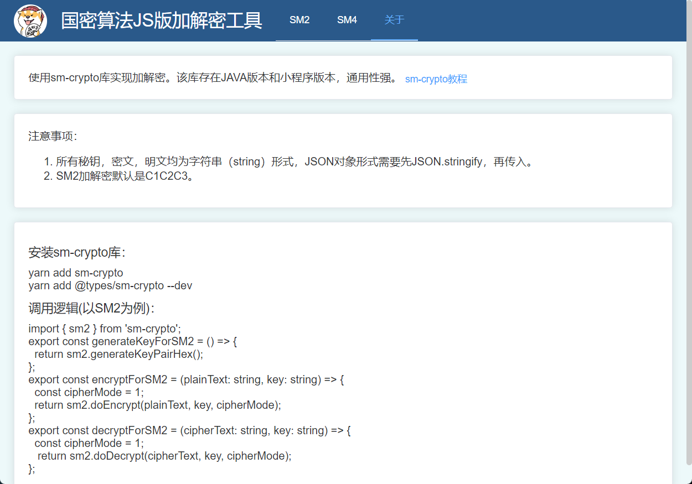

# Tauri-SM-Crypto-Tool

一个简单的国密算法工具。

基于 Tauri + Vue3 + TS 开发的桌面应用，方便验证国密算法的加解密。国密算法使用的是[sm-crypto](https://github.com/JuneAndGreen/sm-crypto)JS库。该库有JAVA版本和小程序版本通用性强，方便前后端对接。

## 功能

* SM2 生成秘钥对
* SM2加解密
* SM4加解密
* SM3 哈希
* JSON格式化

## 使用说明

### windows

直接从release中下载.msi安装使用。

### macOS && Linux

需要自行编译并安装。

## 开发说明

### 准备工作

#### 1.Tauri环境

参考Tauri官方文档：[Tauri](https://tauri.app/zh/v1/guides/getting-started/prerequisites)。

#### 2.前端环境

略。

### 运行项目

clone项目后，安装依赖。然后运行。

``` shell
yarn tauri dev
```

### 打包

参考Tauri官方文档：[Tauri](https://tauri.app/zh/v1/guides/building/)。

``` shell
yarn tauri build
```

## 版本

version 0.0.3

## 界面展示





## 协议

MIT
